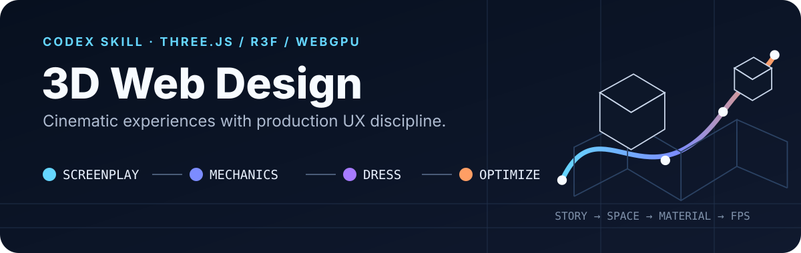

<p align="center">
  
</p>

# 3D Web Design Skill

A Codex skill for planning, building, auditing, and reviewing 3D websites, spatial tools, and browser experiences without letting spectacle outrank usability or rules.

It combines Three.js, React Three Fiber, WebGPU, shaders, GSAP choreography, physics, glTF asset pipelines, open-source adaptation, accessibility, responsive behavior, and performance work into one decision-first method.

## Start here

Clone the repository into the Codex skills folder:

```bash
mkdir -p ~/.codex/skills
git clone git@github.com:promptwhisper/3d-web-design-skill.git \
  ~/.codex/skills/3d-web-design
```

Restart Codex, then invoke the skill:

```text
Use $3d-web-design to classify, plan, build, and prove this accessible,
responsive Three.js launch page.
```

Already installed?

```bash
git -C ~/.codex/skills/3d-web-design pull
```

## The method

```text
CLASSIFY → SCREENPLAY → MECHANICS → DRESS → OPTIMIZE → PROVE
ownership   story         behavior      identity  budgets     evidence
```

| Stage | The decision it answers | Typical output |
| --- | --- | --- |
| **Classify** | Is this a website, spatial tool, game, or visual experiment—and what owns state? | Experience kind, system of record, 3D role, source/license constraints |
| **Screenplay** | What should the visitor see, feel, and do? | Story beats, page kind, visual direction, CTA, accessible DOM fallback |
| **Mechanics** | Does the experience work before it looks expensive? | DOM/routes or simulation state, camera, input, collisions, plain geometry |
| **Dress** | Which materials make the story legible? | Textures, shaders, lighting, sound, post-processing |
| **Optimize** | Does it remain usable on real devices? | Profiling, device tiers, reduced motion, asset and render budgets |
| **Prove** | Does the primary task survive real conditions? | Build/test/audit output, visual evidence, low-tier and fallback QA |

The order is the point. A beautiful shader cannot rescue broken ownership, camera behavior, simulation rules, interaction, or information hierarchy.

## What it helps you build

- immersive portfolios and product launches;
- configurators, editors, maps, data-driven scenes, and WebXR galleries;
- browser games and game-like interfaces with explicit simulation ownership;
- scroll-driven camera paths and spatial storytelling;
- WebGL/WebGPU scenes with Three.js, R3F, drei, or TSL;
- shader reveals, instanced fields, scene transitions, and physics interfaces;
- open-source Three.js repository reviews with code/content/asset license separation;
- production-minded redesigns that preserve routes, SEO, forms, and brand memory;
- reviews focused on performance, assets, state, accessibility, interaction, or visual taste.

Use it selectively. If space does not carry meaning, a strong standard layout is usually the better interface.

## Three design dials

The skill freezes three values before implementation so visual decisions do not drift:

| Dial | Low | High |
| --- | --- | --- |
| `DESIGN_VARIANCE` | restrained and predictable | asymmetric and experimental |
| `MOTION_INTENSITY` | static with micro-interactions | camera paths and pinned scrolltelling |
| `VISUAL_DENSITY` | sparse and gallery-like | compact and operational |

These dials change the composition, motion, and information density together. They are not style labels pasted on after the build.

## Production quality gates

A scene is not finished until the product layer works:

- semantic DOM and keyboard access remain available beside the canvas;
- touch targets, gestures, focus states, and back behavior are predictable;
- mobile receives an intentional experience rather than a shrunken desktop scene;
- `prefers-reduced-motion` preserves the content and task;
- text contrast, line length, and navigation stay readable;
- shaders, textures, draw calls, DPR, and post-processing fit a measured frame budget;
- websites preserve real URLs and semantic content; games preserve rules and restart/recovery; tools preserve data integrity and undo/export;
- visual assets are real project material, not generic “3D-looking” decoration.

## Reference map

```text
3d-web-design/
├── SKILL.md
├── agents/
│   └── openai.yaml
├── references/
│   ├── 3d-asset-pipeline.md
│   ├── experience-architecture.md
│   ├── open-source-casebook.md
│   ├── technique-catalog.md
│   └── frontend-taste-and-ux.md
└── scripts/
    ├── audit-gltf.mjs
    └── audit-three-project.mjs
```

- [`SKILL.md`](SKILL.md) is the compact decision spine loaded at runtime.
- [`technique-catalog.md`](references/technique-catalog.md) contains implementation patterns for cameras, input, state, shaders, instancing, transitions, assets, performance, sound, physics, and architecture.
- [`frontend-taste-and-ux.md`](references/frontend-taste-and-ux.md) contains the visual, responsive, accessibility, redesign, and anti-template quality gates.
- [`3d-asset-pipeline.md`](references/3d-asset-pipeline.md) covers asset provenance, glTF inspection, decoder contracts, material integration, performance, and failure states.
- [`experience-architecture.md`](references/experience-architecture.md) separates website, spatial-tool, and browser-game ownership, loops, lifecycle, and acceptance gates.
- [`open-source-casebook.md`](references/open-source-casebook.md) maps high-signal projects to reusable patterns and records license boundaries.
- [`audit-gltf.mjs`](scripts/audit-gltf.mjs) inspects GLB/glTF structure and runtime decoder requirements.
- [`audit-three-project.mjs`](scripts/audit-three-project.mjs) inventories a project and checks common production, asset, accessibility, lifecycle, and license signals.

Run a read-only project audit:

```bash
node ~/.codex/skills/3d-web-design/scripts/audit-three-project.mjs /path/to/project
```

## Development

Keep the runtime skill concise and progressively disclosed. Put durable details in `references/`; add scripts only when a repeated, fragile operation needs deterministic automation.

Validate the skill frontmatter after editing:

```bash
ruby -ryaml -e '
path = "SKILL.md"
content = File.read(path)
match = content.match(/\A---\n(.*?)\n---/m) or abort "Invalid frontmatter"
fm = YAML.safe_load(match[1])
abort "Missing name" unless fm["name"]
abort "Missing description" unless fm["description"]
puts "Skill frontmatter looks valid"
'
```

When syncing an installed copy back into this repository, inspect the diff before committing:

```bash
cp ~/.codex/skills/3d-web-design/SKILL.md ./SKILL.md
cp ~/.codex/skills/3d-web-design/agents/openai.yaml ./agents/openai.yaml
cp ~/.codex/skills/3d-web-design/references/*.md ./references/
cp ~/.codex/skills/3d-web-design/scripts/*.mjs ./scripts/
git diff --check
git status
```
